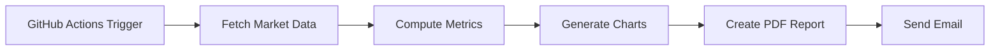

# 📊 Automated Portfolio Analytics & Reporting Pipeline

> **End‑to‑end automated portfolio monitoring system** that fetches market data, computes performance & risk metrics, generates professional PDF reports, and distributes them automatically via email where all scheduled with **GitHub Actions**.

---

## 🚀 What This Project Does

This project removes manual effort from portfolio reporting by fully automating:

*  Market data retrieval using **yfinance**
*  Portfolio‑level & asset‑level performance and risk analytics
*  Visualizations (returns, drawdowns, volatility, correlations)
*  Professional PDF report generation
*  Automated email delivery of reports
*  Scheduled execution using **GitHub Actions**

Once deployed, the pipeline runs **hands‑free** on a schedule.

---

## 🧠 Key Features

* **Portfolio KPIs**: CAGR, volatility, Sharpe ratio, max drawdown
* **Asset‑level metrics**: contribution, volatility, return distribution
* **Visual analytics**:

  * Price trends
  * Cumulative returns
  * Drawdowns
  * Rolling volatility
  * Return distributions
  * Correlation heatmap (Seaborn)
* **Automated PDF formatting** with dynamic scaling
* **Secure email delivery** using SMTP + GitHub Secrets
* **Production‑ready structure** (no notebooks, pure Python)

---

## 🗂️ Project Structure

```text
financial-report-pipeline/
├── main.py                 # Orchestrates the full analytics pipeline
├── send_email.py           # SMTP email utility (PDF delivery)
├── requirements.txt        # Python dependencies
├── README.md               # Project documentation
└── .github/
    └── workflows/
        └── daily.yml       # GitHub Actions automation
```

---

## ⚙️ How the Pipeline Works



**Execution flow:**

1. GitHub Actions starts on a schedule (or manual trigger)
2. `main.py` runs the analytics pipeline
3. Charts and KPIs are generated
4. A formatted PDF report is created
5. The report is emailed automatically

---

## 🛠️ Tech Stack

* **Python**
* **pandas / numpy** – data processing
* **yfinance** – market data
* **matplotlib / seaborn** – visualizations
* **reportlab** – PDF generation
* **SMTP (Gmail App Password)** – email delivery
* **GitHub Actions** – automation & scheduling

---

## 🔐 Required GitHub Secrets

To run this pipeline securely, configure the following **Repository Secrets**:

| Secret Name      | Description           |
| ---------------- | --------------------- |
| `SMTP_SERVER`    | e.g. `smtp.gmail.com` |
| `SMTP_PORT`      | e.g. `587`            |
| `EMAIL_USER`     | Sender email address  |
| `EMAIL_PASS`     | Gmail App Password    |
| `RECEIVER_EMAIL` | Report recipient      |

📍 Path: **Repo → Settings → Secrets → Actions**

---

## ▶️ How to Run Locally

```bash
pip install -r requirements.txt
python main.py
```

> Ensure environment variables are set before running locally.

---

## ⏰ Automation Schedule

Configured via GitHub Actions:

```yaml
schedule:
  - cron: "0 7 * * *"
```

🕖 Runs **daily at 07:00 UTC**

Manual runs can be triggered from the **Actions** tab.

---

## 📌 Output

*  PDF report generated automatically
*  Email delivered with report attached
*  PDF uploaded as a GitHub Actions artifact

---

## 📈 Why This Matters

This project demonstrates:

* Real‑world analytics automation
* Production‑ready Python architecture
* Secure secret handling
* CI/CD‑style data workflows
* Business‑ready reporting (not just analysis)

Ideal for:

* Portfolio monitoring
* Risk reporting
* BI / analytics engineering demonstrations

---

## 🔮 Future Enhancements

* Weekly / monthly report scheduling
* Slack / Teams notifications
* Historical report storage
* Automated written commentary
* API‑based email services (SendGrid)

---

## 🧑‍💻 Author

**Naveen Karan Krishna**
MBA | Business Analytics | Python | Portfolio Analytics

🔗 GitHub: [https://github.com/NK-Mikey](https://github.com/NK-Mikey)

---

⭐ If you find this project useful, feel free to star the repository!
