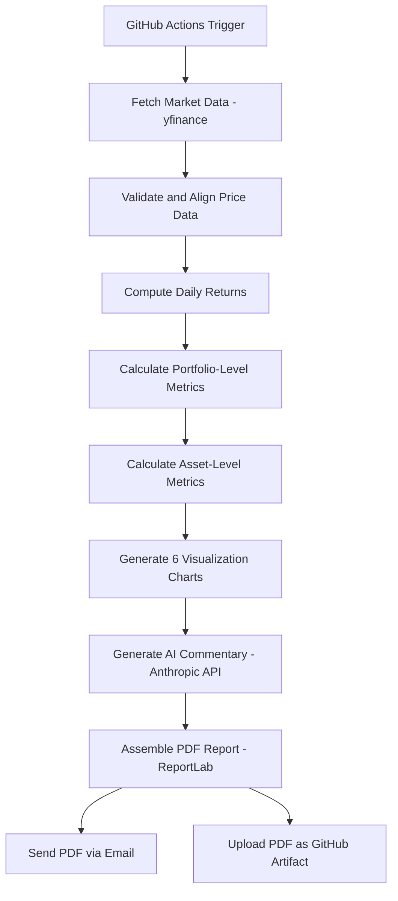

# 📊 Automated Portfolio Analytics & Reporting Pipeline

End-to-end automated portfolio monitoring system that fetches market data, computes performance and risk metrics, generates AI-written commentary, assembles professional PDF reports, and distributes them automatically via email - all scheduled with GitHub Actions.

---

## 🚀 What This Project Does

This project removes manual effort from portfolio reporting by fully automating:

- Market data retrieval using yfinance
- Portfolio-level and asset-level performance and risk analytics
- AI-generated plain-prose commentary via the Anthropic API (Claude)
- Visualizations (returns, drawdowns, volatility, correlations)
- Professional PDF report generation
- Automated email delivery of reports
- Scheduled execution using GitHub Actions

Once deployed, the pipeline runs hands-free on a daily schedule.

---

## 🧠 Key Features

- **Portfolio KPIs:** CAGR, volatility, Sharpe ratio, Sortino ratio, max drawdown, VaR 95%, VaR 99%
- **Asset-level metrics:** return, volatility, Sharpe ratio, max drawdown per holding
- **AI Commentary:** Claude (claude-sonnet-4-6) interprets computed metrics and writes a plain-prose stakeholder summary inserted directly into the PDF
- **Visual analytics:**
  - Price trends
  - Cumulative returns
  - Drawdowns
  - Rolling volatility
  - Return distributions
  - Correlation heatmap (Seaborn)
- Automated PDF formatting with consistent chart sizing
- Secure email delivery using SMTP + GitHub Secrets
- Production-ready structure (no notebooks, pure Python)

---

## 🗂️ Project Structure

```text
financial-report-pipeline/
├── main.py                 # Orchestrates the full analytics pipeline
├── commentary.py           # Anthropic API integration — generates AI commentary
├── send_email.py           # SMTP email utility (PDF delivery)
├── requirements.txt        # Python dependencies
├── README.md               # Project documentation
└── .github/
    └── workflows/
        └── daily.yml       # GitHub Actions automation
```

---

## ⚙️ How the Pipeline Works


```mermaid
flowchart TD
    A[GitHub Actions Trigger] --> B[Fetch Market Data - yfinance]
    B --> C[Validate and Align Price Data]
    C --> D[Compute Daily Returns]
    D --> E[Calculate Portfolio-Level Metrics]
    E --> F[Calculate Asset-Level Metrics]
    F --> G[Generate 6 Visualization Charts]
    G --> H[Generate AI Commentary - Anthropic API]
    H --> I[Assemble PDF Report - ReportLab]
    I --> J[Send PDF via Email]
    I --> K[Upload PDF as GitHub Artifact]
```

**Execution flow:**
1. GitHub Actions starts on a schedule (or manual trigger)
2. `main.py` fetches and validates live market data
3. Portfolio and asset-level metrics are computed
4. Six visualization charts are generated
5. Claude (Anthropic API) generates plain-prose commentary interpreting the metrics
6. A formatted PDF is assembled with commentary, tables, and charts
7. The report is emailed automatically and archived as a GitHub artifact

---

## 🛠️ Tech Stack

| Tool | Purpose |
|---|---|
| Python 3.11 | Core pipeline language |
| pandas / numpy | Data processing and analytics |
| yfinance | Live market data retrieval |
| matplotlib / seaborn | Visualizations |
| reportlab | PDF generation |
| Anthropic API (Claude) | AI-generated portfolio commentary |
| SMTP (Gmail App Password) | Automated email delivery |
| GitHub Actions | Scheduling and automation |
| GitHub Secrets | Secure credential management |

---

## 🔐 Required GitHub Secrets

| Secret Name | Description |
|---|---|
| SMTP_SERVER | e.g. smtp.gmail.com |
| SMTP_PORT | e.g. 587 |
| EMAIL_USER | Sender email address |
| EMAIL_PASS | Gmail App Password |
| RECEIVER_EMAIL | Report recipient |
| ANTHROPIC_API_KEY | Anthropic API key (console.anthropic.com) |

📍 Path: Repo → Settings → Secrets → Actions

---

## ▶️ How to Run Locally

```bash
pip install -r requirements.txt
python main.py
```

Ensure all environment variables are set before running locally.

---

## 📌 Output

- AI-generated plain-prose commentary interpreting portfolio metrics
- PDF report assembled with commentary, metrics tables, and charts
- Email delivered automatically with report attached
- PDF uploaded as a GitHub Actions artifact

---

## 📈 Why This Matters

This project demonstrates:
> **Disclaimer:** This project is built for portfolio demonstration purposes only. Not intended for actual investment decisions. AI-generated commentary is clearly labelled as synthetic within the report and does not constitute financial advice.

- LLM API integration into a production Python pipeline
- Real-world analytics automation with scheduled execution
- Production-ready Python architecture (modular, no notebooks)
- Secure secret handling across multiple credentials
- CI/CD style data workflows via GitHub Actions
- Business-ready reporting with AI-generated stakeholder commentary

---

## 🔮 Future Enhancements

- Weekly and monthly report scheduling
- Slack or Teams notifications
- Historical report storage
- Benchmark comparison (SPY overlay)
- Monte Carlo simulation
- Dynamic portfolio weights from config file

---

## 🧑‍💻 Author

**Naveen Karan Krishna**
MBA | Business Analytics | Python | Portfolio Analytics

🔗 GitHub: [https://github.com/NK-Mikey](https://github.com/NK-Mikey)

---

⭐ If you find this project useful, feel free to star the repository!
